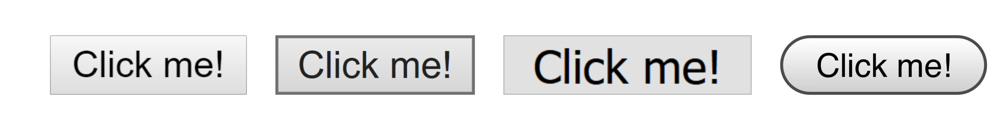

import Example1 from './Example1';
import Example2 from './Example2';

Buttons and hyperlinks are the cornerstones of the internet. Buttons allow users to interact with web content and links allow users to discover more content. They provide dynamic experiences and user autonomy—two things the web could not live without. Because they're so central to the online experience, it's crucial that we get them right for everybody.

One common antipattern, especially in a framework-driven world, is adding click event listeners to HTML elements that aren't usually clickable. Let's call this the <dfn>clickable div antipattern</dfn>, even though the elements don't have to be <i>div</i> elements.

Here's a minimal example of a clickable div that uses the `onclick` attribute. The `btn` class is adapted from [Bootstrap](https://getbootstrap.com/). Go ahead and click it!

<Example1 />

```html {numberLines: true}:title=index.html
<div class="btn" onclick="doSomething();">
    Click me!
</div>
```

<br/>

## The Allure of Clickable Divs

An <dfn>antipattern</dfn> is a *deceptively compelling* solution to a problem that proves to be ineffective or harmful in the long run. An antipattern's allure is what distinguishes it from bad habits or simply incorrect solutions.

So... what is the allure of clickable divs? Why would someone resort to `<div onclick>` when the `<button>` element has been around for two decades?

The main motivation I've seen for writing a clickable div is **quick-and-easy, yet total, control over design.**

Buttons have many different default styles across the full spectrum of browsers:



Wrangling those defaults can feel like a pain, [as CSS-Tricks points out](https://css-tricks.com/overriding-default-button-styles/#article-header-id-1). What if you just want a button that looks like a link, or a nice [floating action button](https://material.io/components/buttons-floating-action-button/)? Do you *really* want to fight with every browser on every device to make that work?

`<div>` elements come with a compelling promise: they're clean slates. `<div>`s don't come with any of the baggage that `<button>` elements do. They only come with one default style: `display: block;`. The developer can breathe a sigh of relief. They have their empty canvas of infinite flexibility.

Besides... the button works, right? You can click it!

## Remediation

When you create a clickable div, you're electing to implement your own button from scratch. Users expect certain behavior and functionality from their buttons. It's like a contract! Clickability is the most obvious clause of this contract, but there's more to buttons than that.

Good news, though! Our clickable div can be salvaged. We just need to make sure our clickable div follows the button contract. You can [read the Web Accessibility Initiative's layout of button expectations](https://www.w3.org/TR/wai-aria-practices/#button), or just follow along here.

### Focus

Not every person who comes to your site will use a mouse to navigate the page. Many users will instead use keyboard navigation. For instance, they might have a mobility impairment that restricts mouse manipulation, or they might not be able to see a cursor. They might not even be disabled. After all...

<Blockquote
    attribution={
        <a href="https://twitter.com/aardrian/status/388733408576159744">Adrian Roselli</a>
    }
>
    "Everybody is a keyboard user when eating with their mouse hand."
</Blockquote>

The core tenet of keyboard navigation is managing <dfn>focus</dfn>: which element is currently active and can be manipulated with the keyboard. Users control the focus by clicking <kbd>Tab</kbd> to go forward and <kbd>Shift+Tab</kbd> to go backwards. Let's try tabbing to our first clickable div:

<Example1 />

The focus just skips straight from the Adrian Roselli attribution to the `tabindex` documentation link below, skipping our example clickable div in the process. It's clear this is a problem: how are keyboard-navigating users going to be able to *interact* with our button if they can't even get to it?

Fortunately, the fix is simple: we'll just specify the attribute `tabindex="0"`. Why `"0"`? [`tabindex`](https://developer.mozilla.org/en-US/docs/Web/HTML/Global_attributes/tabindex) accepts three kinds of values:

* **`"0"`**: The element is inserted into the focus order based on where it is in the DOM.

* **A positive number:** The element is inserted into the focus order relative to other elements that have `tabindex` set. This generally makes your page harder for keyboard-navigating users to operate.

* **A negative number, usually `"-1"`**: The element is focusable programmatically (via JavaScript), but not via keyboard navigation. This does not solve our problem.

Let's add the `tabindex` and verify that our button is now tabbable.

<Example2 />

```html {numberLines: true}:title=index.html
<div class="btn" tabindex="0" onclick="doSomething();">
    Click me!
</div>
```

Now that you can actually tab to the button, it's a really good time to [make sure you set some focus styles](https://css-tricks.com/focusing-on-focus-styles/). That way, people know when they're focusing on your button.

### Key Presses

### Role

### State

## Or...

## A Deeper Problem

## Prior Art

I'm by no means the first person to write this, and I won't be the last. I've listed a few resources I found immensely useful that you might, too:

* Vadim Makeev's ["When Is A Button Not A Button?"](https://www.smashingmagazine.com/2019/02/buttons-interfaces/) for *Smashing Magazine*
* Andy Bell's ["Introducing the Button element"](https://hankchizljaw.com/wrote/introducing-the-button-element/)
* Chris Coyier's ["Overriding Default Button Styles"](https://css-tricks.com/overriding-default-button-styles/) on CSS-Tricks